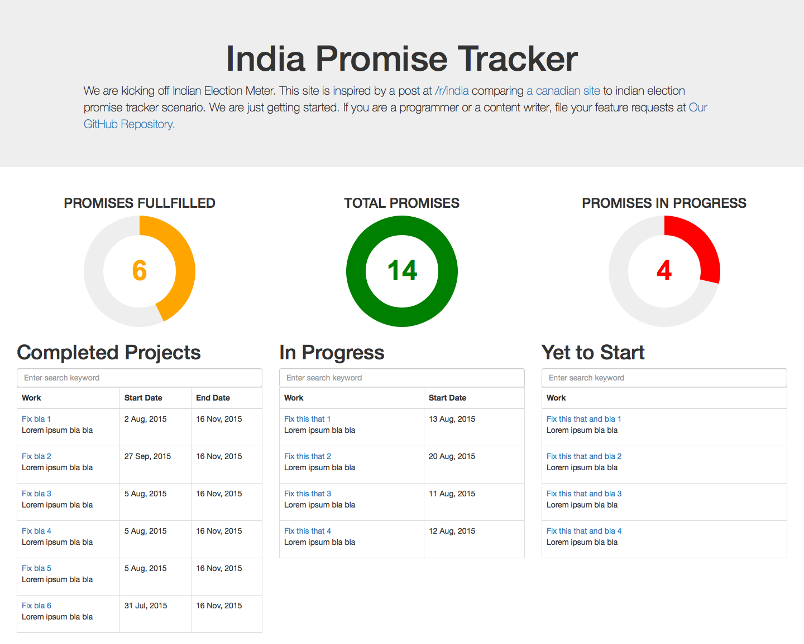

# India Promise Tracker
React based Implementation of [indianelectionmeter](https://github.com/reddit-india/indianelectionmeter.github.io)

# Steps to setup this project locally
1) You need node.js/ npm installed [https://nodejs.org/en/download/package-manager/](https://nodejs.org/en/download/package-manager/)

2) Install the project dependencies:
	
>npm install

3) Run the development server:
> gulp server

4) Use babel to transform jsx to js
> npm run build
This will open the site in a browser and when there is a change in the code, the browser will automatically reload and reflect the changes. 

# Screenshot

# Todo
* [ ] Use JSX
* [ ] Make use of highcharts to show graph of delivery of promises
* ...
